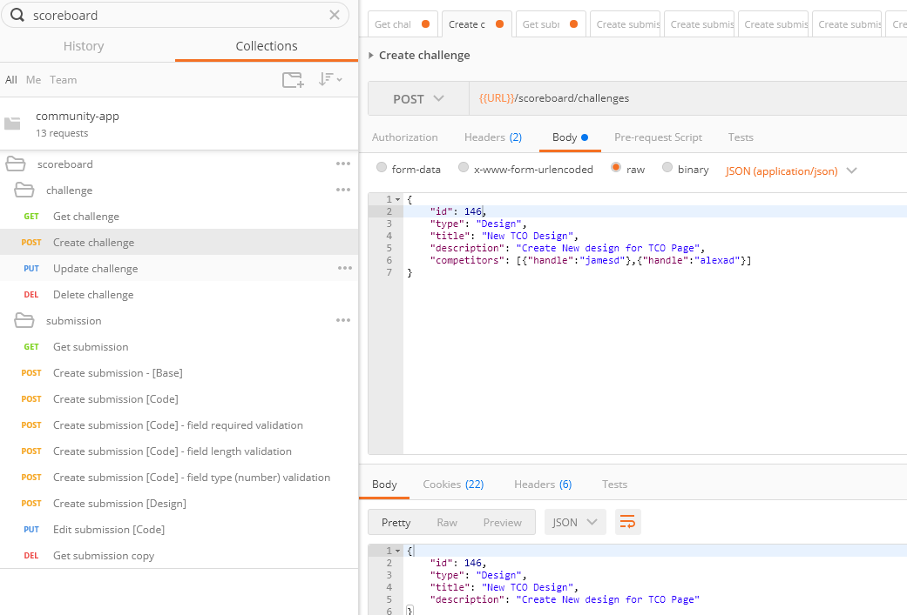

# Topcoder - TCO Scoreboard

## Setup

- Follow the instructions in [`Community Service Readme`](../../README.md) to setup the database and service.

## Postman Verification

- Import postman collection / environment from [`/community-service/docs/scoreboard`](.)

- Login to http://local.topcoder-dev.com:3000 using `amy_admin/topcoder1` as credentials and note down the token from the console.

- Use the above token to set the Postman environment variable `token`.

### Challenge Endpoints Verification

#### Get Challenge Details

#### Create New Challenge

#### Requesting with expired token

#### Updating Challenge

##### Verifiying that update was successful

#### Deleting Challenge

##### Verifiying that delete was successful

### Submission Endpoints Verification

#### Get Submission Details

#### Create Base Submission

#### Create submission with code template

#### Create submission field validation

Values taken from [`/community-service/config/tco/submissionCodeFields.json`](../../config/tco/submissionCodeFields.json).

#### Create submission field length validation

#### Create submission field type validation

#### Create submission with design template

#### Update submission

#### Delete submission

### Public Page Verification

- Add a Code Challenge and a few submissions to it and you will see the below table.
- The fields are loaded dynamically based on the configuration files [`/community-service/config/tco/submissionCodeFields.json`](../../config/tco/submissionCodeFields.json) and [`/community-service/config/tco/submissionDesignFields.json`](../../config/tco/submissionDesignFields.json).

- By default challenge ID 123 is setup for Code and 1234 for Design.

- **Note that when creating data, you can add submissions only for the handles associated with the challenge.**

#### Code Challenge

#### Design Challenge

